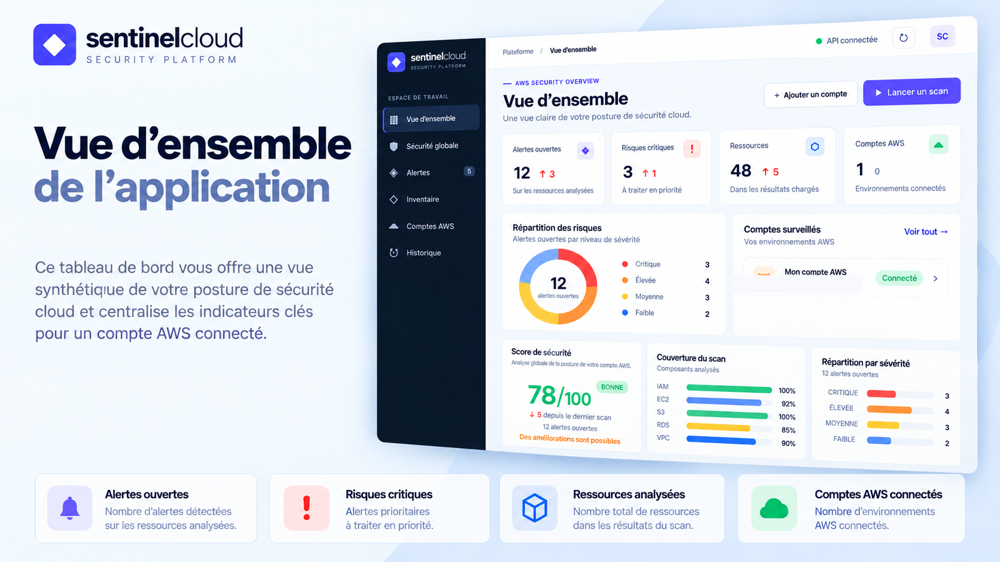
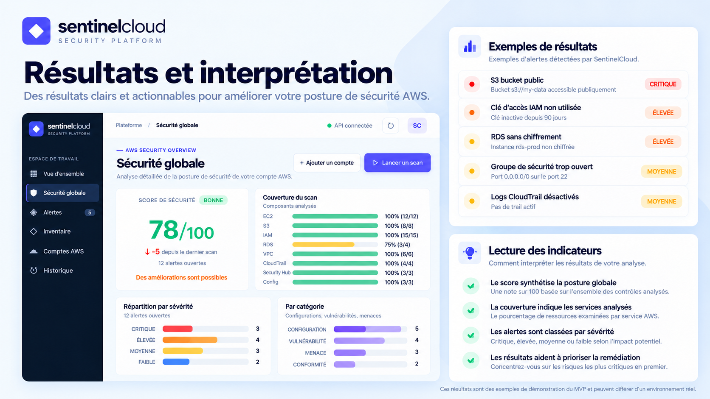

# SentinelCloud

SentinelCloud est un MVP de plateforme CNAPP orientée AWS, conçu pour donner une vue claire de la posture de sécurité d'un environnement cloud.

Le projet repose sur une architecture agentless et une approche en lecture seule : l'application interroge les API AWS, collecte les configurations utiles, les normalise, applique des contrôles de sécurité puis restitue les résultats dans un tableau de bord.

> Les captures et valeurs chiffrées visibles dans ce dépôt sont des données de démonstration destinées à illustrer le fonctionnement du MVP.

## Objectifs du projet

- connecter un environnement AWS sans déployer d'agent
- inventorier les principales ressources cloud
- analyser les configurations de sécurité
- identifier et prioriser les risques
- calculer un score de posture de sécurité
- mesurer la couverture d'un scan
- présenter les résultats dans une interface web claire
- conserver un historique exploitable des analyses

## Architecture générale


Le flux principal est le suivant :

```text
Utilisateur
  -> Interface web
  -> API FastAPI
  -> Service de scan
  -> Authentification AWS
  -> Collecteurs AWS
  -> Normalisation
  -> Moteur de règles CSPM
  -> Score, alertes, couverture
  -> Stockage local
  -> Tableau de bord
```

Pour plus de détails, voir [docs/architecture.md](docs/architecture.md).

## Fonctionnement

1. L'utilisateur sélectionne un compte AWS à analyser.
2. SentinelCloud utilise une session AWS en lecture seule.
3. Les collecteurs interrogent les API AWS officielles.
4. Les ressources sont normalisées dans un format commun.
5. Un moteur de règles vérifie les configurations à risque.
6. Les findings sont classés par sévérité.
7. Un score de sécurité et une couverture de scan sont calculés.
8. Les résultats sont enregistrés et affichés dans le tableau de bord.

Voir [docs/fonctionnement.md](docs/fonctionnement.md).

## Services AWS ciblés

Le MVP couvre ou prévoit la collecte de données sur plusieurs services AWS :

- IAM
- EC2
- S3
- RDS
- VPC
- CloudTrail
- AWS Config
- Security Hub
- Lambda
- ECR
- EKS

Le périmètre est volontairement extensible afin d'ajouter progressivement de nouveaux contrôles et services.

## Sécurité et accès AWS

SentinelCloud privilégie une approche à privilèges minimaux.

Méthodes d'authentification possibles :

- profil AWS CLI
- session AWS via `aws login`
- rôle IAM cross-account avec `sts:AssumeRole`

Principes de sécurité :

- aucune clé longue durée n'est requise par l'application
- lecture seule pour la collecte
- séparation entre authentification et logique d'analyse
- possibilité de restreindre précisément les permissions AWS
- pas d'agent installé dans les workloads

Voir [docs/securite.md](docs/securite.md).

## Exemple d'interface



Le tableau de bord centralise notamment :

- nombre d'alertes ouvertes
- risques critiques
- nombre de ressources analysées
- comptes AWS connectés
- répartition des risques par sévérité
- score de sécurité
- couverture du scan

## Exemple de résultats



Exemples de contrôles possibles :

- bucket S3 public
- clé d'accès IAM ancienne ou inutilisée
- base RDS non chiffrée
- security group trop permissif
- CloudTrail désactivé

Les résultats sont organisés par sévérité, service, catégorie et ressource impactée.

## Stack technique

- Python
- FastAPI
- boto3 / botocore
- SQLite
- HTML
- CSS
- JavaScript
- AWS APIs

## Présentation

[Présentation PowerPoint](docs/presentation/SentinelCloud-presentation.pptx)

## Roadmap

La suite du projet prévoit notamment :

- enrichissement du moteur de règles CSPM
- meilleure gestion multi-comptes
- rôles IAM cross-account
- historique avancé des scans
- recommandations de remédiation
- support PostgreSQL
- export de rapports
- déploiement conteneurisé
- intégration CI/CD

Voir [docs/roadmap.md](docs/roadmap.md).

## Statut

MVP technique / Proof of Concept.

Ce dépôt présente l'architecture, la logique produit et les choix de sécurité. Le code source applicatif n'est pas publié ici.
