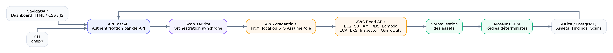

# Architecture de SentinelCloud

## Vue d'ensemble

SentinelCloud suit une architecture agentless pensée pour analyser un environnement AWS sans modifier les ressources surveillées.

### 1. Interface utilisateur

Le navigateur affiche le tableau de bord et permet de lancer les scans, consulter l'inventaire, les alertes, les comptes connectés et l'historique.

### 2. API backend

FastAPI expose les endpoints nécessaires à l'interface et orchestre les opérations applicatives.

### 3. Service de scan

Le service de scan coordonne la collecte des données, l'exécution des contrôles et la persistance des résultats.

### 4. Authentification AWS

La connexion peut utiliser un profil AWS CLI, une session AWS temporaire ou un rôle IAM cross-account.

### 5. Collecteurs AWS

Les collecteurs interrogent les API AWS en lecture seule. Chaque collecteur est spécialisé par service.

### 6. Normalisation

Les données issues de services différents sont converties dans une représentation cohérente afin de simplifier l'application des règles.

### 7. Moteur de règles CSPM

Le moteur compare l'état réel des ressources à des règles de sécurité et génère des findings classés par sévérité.

### 8. Score et couverture

Le score synthétise la posture globale. La couverture permet d'indiquer quels services et ressources ont réellement été analysés.

### 9. Stockage

Le MVP stocke localement les résultats, l'historique et les informations nécessaires à l'affichage.

### 10. Restitution

Les résultats sont présentés sous forme d'alertes, inventaire, score de sécurité, couverture et historique.

## Diagramme

